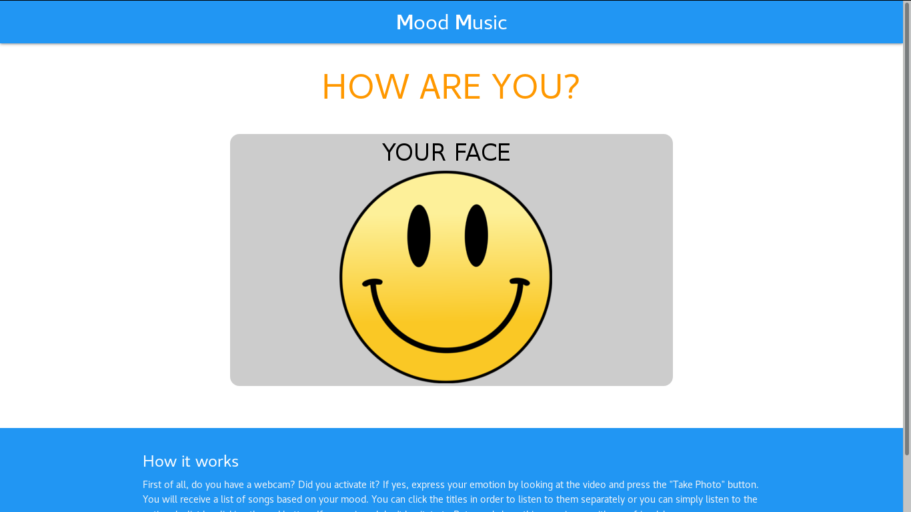
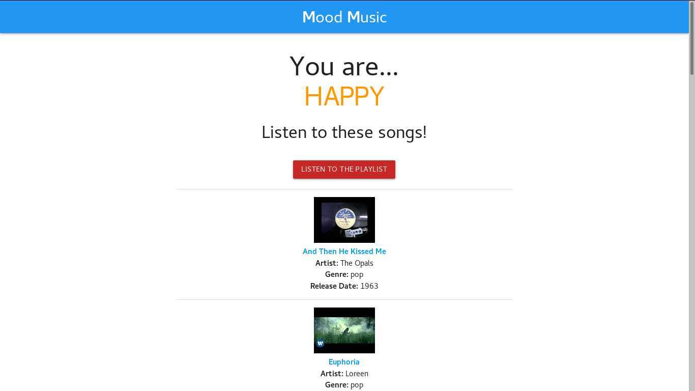

# mood-music
:musical_note: Music based on Your Mood

# Mood Music
> Music based on your Mood

Mood Music is a website using an emotion recognition algorithm to analyze your mood and give you an appropriate list of songs.

## Demo

Click this link for the working live demo: [Mood Music](https://pietromoretto.github.io/mood-music/)

## Usage example

Express your emotion by looking at the video and press the "Take Photo" button and...

... get the result page with the songs.

## Built With

* [Materialize CSS](https://materializecss.com/) - A modern responsive front-end framework based on Material Design
* [Clmtrackr](https://github.com/auduno/clmtrackr) - Javascript library for precise tracking of facial features via Constrained Local Models 
* [Youtube Data API](https://developers.google.com/youtube/v3/) - Add YouTube features to your application, including the ability to upload videos, create and manage playlists, and more
